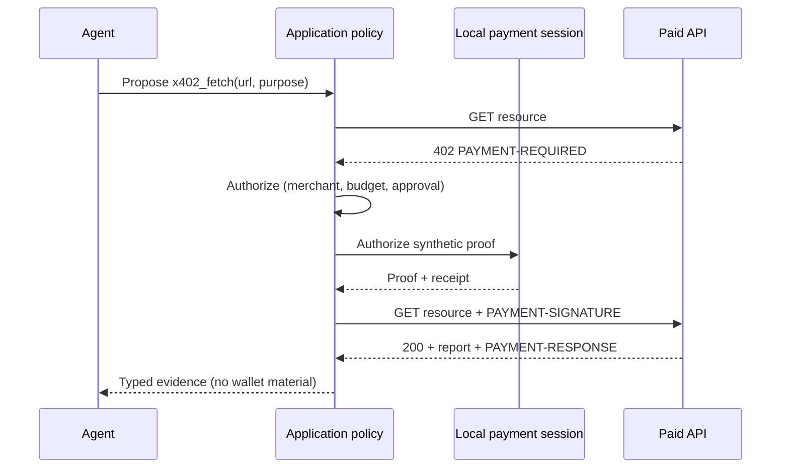

ProcureNet already orchestrates buyer sessions, USDC settlement, and background AI agents. This guide shows how an **agentic commerce** pattern fits those concepts when an agent needs to call a **paid API** that speaks the [x402](https://github.com/coinbase/x402) `HTTP 402 Payment Required` challenge.

The runnable example lives at [`examples/agentic-commerce-x402/`](https://github.com/mindtdilly/Omnipay/tree/main/examples/agentic-commerce-x402). It is adapted from the OpenAI Cookbook partner example *Controlled agentic commerce with AgentCore Payments*.

<Warning>
  **Local simulation only.** This example never moves real funds. There are no live payment gates, no AWS credentials, no Amazon Bedrock AgentCore calls, and no wallet private keys. Synthetic payment proofs only. Live AgentCore Payments is intentionally out of scope for this guide (`value_transferred=false`).
</Warning>

## What you will learn

- How four authority boundaries cooperate: agent, application policy, payment session, paid API
- How that maps to ProcureNet [session lifecycle](/concepts/session-lifecycle), [USDC settlement](/concepts/payment-settlement), [orchestration](/concepts/orchestration-modes), and [AI agents](/configuration/ai-agents)
- How to run the local pytest suite without network payment side effects

## Architecture in four responsibilities

| Layer | Owns | Does not own |
|---|---|---|
| **Agent** | Tool selection and a typed proposal | Approval, budget, wallet access, settlement truth |
| **Application policy** | Merchant allowlist, purpose, spending limits, human approval, idempotency, receipts, audit | Signing credentials |
| **Payment session (simulated)** | Synthetic proof generation inside a bounded local adapter | Business authorization |
| **Paid API (merchant)** | `402` challenge and fulfillment when a valid proof is presented | Deciding whether your app may spend |

In the Omnipay package these map to:

1. `omnipay_x402.agent` — scripted one-tool loop (no live model SDK required)
2. `omnipay_x402.policy` + `CommerceApplication` — application-owned controls
3. `LocalPaymentProcessor` — synthetic proofs; `aws_stub.live_agentcore_status()` returns `SKIPPED` / `NOT_READY`
4. `SyntheticMerchant` — in-memory HTTP transport that returns `402` then `200`



## How x402 works in the sim

1. The merchant returns **HTTP 402** with a machine-readable `PAYMENT-REQUIRED` header.
2. The application treats that challenge as a **proposal**, validates it against policy, and optionally requires a human `ApprovalGrant`.
3. `LocalPaymentProcessor` creates a **synthetic** proof bound to an idempotency key.
4. The application retries with `PAYMENT-SIGNATURE`. The merchant verifies the proof and returns the paid content plus `PAYMENT-RESPONSE`.
5. An append-only **audit trail** records the sequence for later review.

Nothing in this path touches a chain, a wallet, or an external payment provider.

## Map onto ProcureNet concepts

<CardGroup cols={2}>
  <Card title="Session lifecycle" icon="arrows-spin" href="/concepts/session-lifecycle">
    Treat the commerce `session_expires_at` and approval windows like ProcureNet
    session TTLs: expire closed, never silently extend spending authority.
  </Card>
  <Card title="Payment settlement" icon="coins" href="/concepts/payment-settlement">
    Production ProcureNet settles USDC via
    [`usdc-request`](/api/usdc-request),
    [`usdc-watch`](/api/usdc-watch), and
    [`usdc-manual-confirm`](/api/usdc-manual-confirm).
    The example only **shapes** the same currency/network vocabulary locally.
  </Card>
  <Card title="Orchestration modes" icon="diagram-project" href="/concepts/orchestration-modes">
    Application policy—not the model—owns merchant allowlists and budgets,
    analogous to how orchestration modes choose transport and prefill depth.
  </Card>
  <Card title="AI agents" icon="robot" href="/configuration/ai-agents">
    Like OpenClaw workers, the economic tool is application-bound. Agents propose;
    they do not mint approvals or hold settlement truth.
  </Card>
</CardGroup>

<Tip>
  When you later wire a real paid supplier API into ProcureNet, keep the same
  split: session + policy in your backend, settlement via the USDC APIs, and
  agents limited to proposing tool calls against pre-bound capabilities.
</Tip>

## Run the local example

```bash
cd examples/agentic-commerce-x402
uv sync
uv run pytest
```

Expected coverage includes:

- **Happy path** — approved purchase completes the full `402 → proof → 200` sequence with audit events
- **Denial without approval** — amounts above the threshold fail with `human_approval_required` before any synthetic charge
- **Fabricated receipt rejection** — agent output that invents a `receipt_id` fails closed against application evidence

Confirm the safety invariants:

```python
from omnipay_x402 import VALUE_TRANSFERRED, live_agentcore_status

assert VALUE_TRANSFERRED is False
assert live_agentcore_status()["status"] == "SKIPPED"
```

## Attribution

Adapted from the OpenAI Cookbook example *Controlled agentic commerce with AgentCore Payments* (authors: Deepak Jain and Sid Rampally). See [`examples/agentic-commerce-x402/SOURCE.md`](https://github.com/mindtdilly/Omnipay/blob/main/examples/agentic-commerce-x402/SOURCE.md) for the upstream URL and intentional omissions (all live AgentCore / AWS modules).
